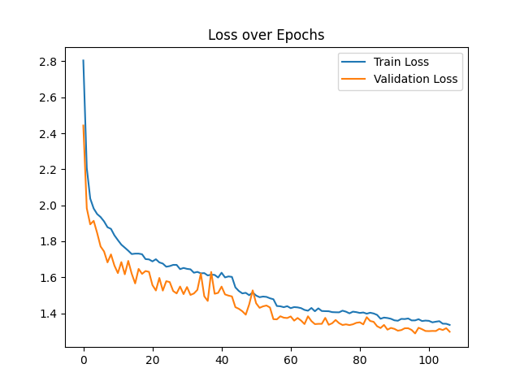
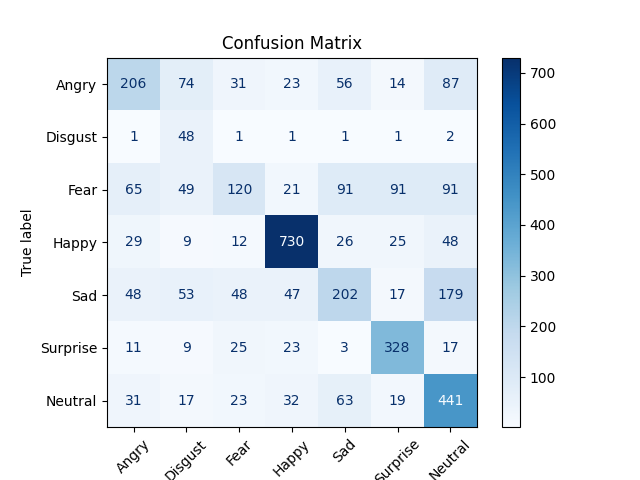

# 1. Introduction

In this work, we focus on emotion recognition through human facial expressions, which is a widely used and intuitive approach. Thanks to the development of deep learning, especially Convolutional Neural Networks (CNNs), facial emotion recognition has become more accurate and efficient.

# 2. Proposed model

The proposed model follows a sequential convolutional architecture designed for facial emotion classification.

# 3. Experiments
## 3.1 Dataset

All experiments are conducted on the FER-2013 dataset, which contains 35,887 grayscale images of size 48×48 pixels, categorized into seven emotion classes: Angry, Disgust, Fear, Happy, Sad, Surprise, and Neutral. The dataset is split into 28,709 training images, 3,589 validation images, and 3,589 test images, following the original distribution. All images are center‐cropped and normalized before being fed into the model. Data augmentation is applied only to the training set.

## 3.2 Metric

Model evaluation is based on *categorical accuracy*, which measures the proportion of correctly predicted emotion classes over the total number of predictions.

## 3.3 Experimental Setup

The model is compiled with the Adam optimizer (learning rate = 0.001). Class weights are applied to mitigate dataset imbalance. The network is trained for up to 200 epochs on a Google Colab virtual machine equipped with an NVIDIA L4 GPU. During training, both training and validation accuracy and loss are logged to analyze convergence behavior and generalization performance.

## 3.4 Experimental Result

### Accuracy over Epochs

### Loss over Epochs

## Confusion Matrix

# 4. In-depth Report

